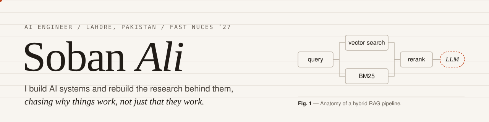

<picture>
  <source media="(prefers-color-scheme: dark)" srcset="./assets/banner-dark.svg">
  
</picture>

  <a href="https://sobanali.vercel.app">Portfolio</a> &nbsp;·&nbsp;
  <a href="https://linkedin.com/in/sobanali256">LinkedIn</a> &nbsp;·&nbsp;
  <a href="mailto:sobanali256@gmail.com">sobanali256@gmail.com</a>

AI Engineer · Computer Science at FAST NUCES, Lahore · Graduating June 2027

## Now

- **AI Intern at Ledelsea** (Apr 2026 – present), building an AI platform that reads an application's source code and writes and runs its end-to-end tests, with LangGraph, Amazon Bedrock and Playwright.
- Earlier at Ledelsea: Claude skills that write complete RFP proposals, and the retrieval core of a hybrid RAG proposal generator.
- Ranked **117th of 1,980 teams** in the Reply Code Challenge 2026 with a multi-agent fraud-detection pipeline.
- Open to AI engineering roles.

## Selected work

| Project | What it is | Result |
|---|---|---|
| [Malware Detection, Replicated](https://github.com/sobanali256/malware-detection-research-replication) | Rebuilt a 2025 paper: VGG-16 fine-tuned on binaries rendered as images | **99.10%** accuracy on Malimg |
| [AniTrack](https://anitrack-a3031.web.app) | Installable anime journal with watch lists, airing schedules and recommendations from AniList and Jikan | Live PWA on Firebase |
| [WarRoom](https://github.com/sobanali256/War-Room) | Three CrewAI agents negotiate a contract's terms to agreement | **75%** cheaper than a GPT-4o equivalent |
| [ML From Scratch](https://github.com/sobanali256/Machine-Learning) | Naive Bayes, logistic regression and neural networks in raw NumPy | No ML libraries |
| [Resume Analyzer](https://github.com/sobanali256/AI_Resume_Analyzer) | OpenAI-powered resume audit with vagueness detection and cover-letter drafts | Full report in **under 10 s** |

## Stack

| Area | Tools |
|---|---|
| **Generative AI** | LangGraph, LangChain, CrewAI, Amazon Bedrock, Claude API, OpenAI API, Hugging Face, LangFuse |
| **Retrieval** | pgvector, ChromaDB, all-MiniLM, BM25, hybrid search |
| **Machine learning** | PyTorch, TensorFlow, Keras, scikit-learn, OpenCV |
| **Data** | NumPy, Pandas, Matplotlib, NLTK |
| **Engineering** | Python, TypeScript, React, FastAPI, Node.js, PostgreSQL, Docker, AWS, Playwright |
